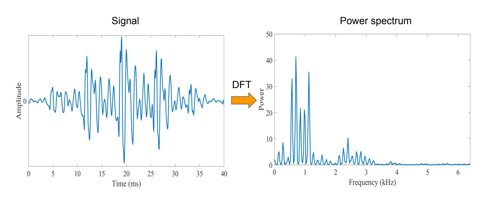
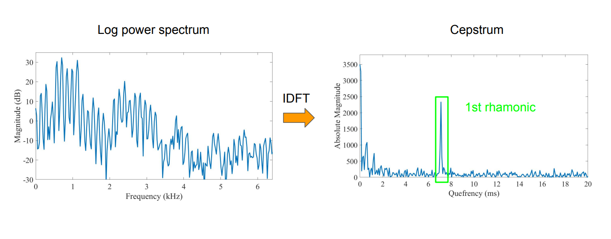
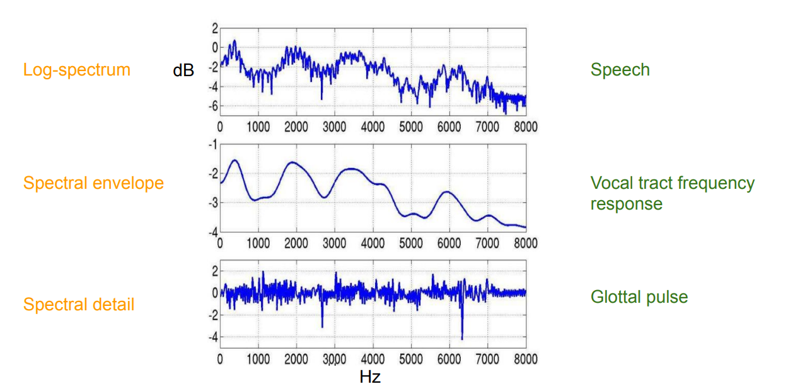

# Mel-Frequency Cepstral Coefficients Explained Easily (梅尔频率倒谱系数)
## 一、An historical note on Cepstrum - (倒频谱的历史发展记录)
- Developed while studying echoes in seismic signals (1960s) - (在研究地震信号的回声研究中被发展起来)
- Audio feature of choice for speech recognition / identification (1970s) - (音声识别鉴定的语音特征选择)
- Music processing (2000s) - (音乐处理)

## 二、Computing the cepstrum (倒谱分析)
$$C(x(t))=F^{-1}[log(F[x(t)])]$$

$$C(\underbrace{x(t)}_{\textnormal{Time-domain Signal}})=\underbrace{F^{-1}[\underbrace{log(\underbrace{F[x(t)]}_{\textnormal{Spectrum}})}_{\textnormal{Log spectrum}}]}_{\textnormal{Cepstrum}}$$
> 在频谱的对数的基础上，再进行一次逆傅里叶变换，则得到”倒频谱“

## 三、Visualising the cepstrum (可视化倒频谱)
### 1. $\textnormal{Time-domain signal}\mathop{\rightarrow}\limits^{DFT}\textnormal{Power spectrum}$ (时域信号$\mathop{\rightarrow}\limits^{DFT}$能量谱)

> $\textnormal{Power}=\textnormal{Amplitude}^2$
### 2. $\textnormal{Power spectrum}\mathop{\rightarrow}\limits^{log}\textnormal{Log power spectrum}$ (能量谱$\mathop{\rightarrow}\limits^{log}$对数能量谱)

### 3. $\textnormal{Log power spectrum}\mathop{\rightarrow}\limits^{IDFT}\textnormal{Ceptrum}$ (对数能量谱$\mathop{\rightarrow}\limits^{IDFT}$倒谱)

> Quefrency: 倒频率
>
> 倒谱图的peak：it reflects the harmonic structure of the original signal that is represented in a periodic way in the log power spectrum. （它反映了原始信号的谐波结构，在对数功率谱中以周期性的方式表示。）什么意思????

## 四、Speech generation (语音产生的pipeline（管道结构）)

- Glottal pulses(声门脉冲): 类似于一个单一的噪声信号
  > 携带音高、高频等信息
- Vocal tract (声道): 充当Glottal pulses的"filter" 
  > 给原始的声门脉冲增加音色、音素等信息，例如元音和辅音
- Speech signal(语音信号): 声门脉冲 经过 声道 过滤后创建 语音信号

## 五、Understanding the cepstrum (理解倒谱)
### 1. Formants
Formants = Carry identity of sound (共振峰=携带声音的特性（哪些音素）)

> 第二个图中的红点（包络的peak）是**共振峰**
>
> **共振峰**: 是指在声音的**频谱中能量相对集中的一些区域**，共振峰不但是音质的决定因素，而且**反映了声道（共振腔）的物理特征**。

### 2. Understanding the cepstrum

$$\textnormal{Log-spectrum (对数谱)}\rightarrow\textnormal{speech (语音信号)}$$

$$\textnormal{spectral envelope (谱包络)}\rightarrow\textnormal{vocal tract frequency response (声道频率响应)}$$

$$\textnormal{Glotta pulse (声门脉冲)}\rightarrow\textnormal{spectral detail (谱细节)}$$

## 六、Speech = Convolution of vocal tract frequency response with glottal pulse
> **语音信号** = **声道频率响应** 与 **声门脉冲** 的卷积 (时域卷积$\rightarrow$频域相乘)
$$x(t)=e(t) * h(t)$$

$$\Downarrow DFT$$

$$X[k]=E[k]\cdot H[k]$$

$$\Downarrow log$$

$$log(X[k])=log(E[k])+log(H[k])$$

$$\Downarrow IDFT$$

$$x[k]=e[k]+h[k]$$

> **使用对数的好处**：
> 1. 使频域中的声道频率响应 与 声门脉冲 分离(使用加法相加)，这样就可以只关注更重要的**声道频率响应**
>
>    
>
> 2. 人的感知与频率的对数帧正比，正好用log模拟

> 卷积定理: (时域卷积等于频域相乘)$$\mathscr{F}[f_1(t)*f_2(t)]=F_1(j\omega)F_2(j\omega)$$
> 
> 相乘定理: (频域卷积等于时域相乘再乘$2\pi$)$$\mathscr{F}^{-1}[F_1(\omega)*F_2(\omega)]=2\pi f_1(t)f_2(t)$$
>
> 证明见[为什么时域卷积等于频域相乘 (zhihu)](https://zhuanlan.zhihu.com/p/574566780) 或 [信号与系统(奥本海姆中译版)P199](../../../%E4%BF%A1%E5%8F%B7%E4%B8%8E%E7%B3%BB%E7%BB%9F.pdf)

- 我们可以从 low quefrency value 中得到  语音频谱信号中**缓慢**变化的信息 
  > 基音信息：与频谱包络相关的信息，如 共振峰的信息、音素、音色
- 我们可以从 high quefrency value 中得到 语音频谱信号中**快速**变化的信息 
  > 声道信息：声门脉冲，如 音高
- 使用低通滤波器，过滤掉 high quefrency 中的信息，**仅关注 与频谱包络相关的信息**

## 七、Why Discrete Cosine Transform? (为什么使用DCT)
- Simplified version of Fourier Transform (傅里叶变换的简化版)
- Get real-valued coefficient (获得实值系数)
- Decorrelate energy in different mel bands (在不同的mel波段 decorrelate 能量)
- Reduce # dimensions to represent spectrum (减少频率维度的向量数量来表示频谱)

DCT公式：(与DFT相似，时域$\rightarrow$频域)
$$F(u)=c(u)\sum_{x=0}^{N-1}f(x)cos[\frac{(x+0.5)\pi}{N}u]，\ \ u=0,1,\cdots N-1$$
$$
c(u)=
    \begin{cases}
    \text{$\displaystyle\sqrt{\frac{1}{N}}\qquad u=0$}\\
    \text{$\displaystyle\sqrt{\frac{2}{N}}\qquad u\neq0$}\\
    \end{cases}
$$
> DCT后得到12维的MFCC特征
- $c(u)$：正交化因子，主要是为了在DCT变换变成矩阵运算的形式时，将该矩阵正交化以便于进一步的计算，实际计算中可以去掉$c(u)$
- $f(x)$：时域信号
- cos内是$\pi$而不是$2\pi$的原因：DCT将信号长度扩大成原来的2倍,长度变成2N
- cos内 $x+0.5$ 的原因：把整个延拓的信号向右平移 0.5 个单位，让插值后的信号关于远点对称

> 假设输入$f(x)$为实偶函数的原因：
>
> 实现简化，并且这样的信号在多数应用场景中都是有效的。
> 
> 实偶信号是指具有对称性的信号，它具有相同的正频和负频分量。因此，在 DCT 变换中，只需要考虑一半的分量即可。这样可以大大减少运算复杂度，因此对于大多数应用来说，实现简化是有益的。
> 
> 在许多实际应用中，例如图像压缩和音频处理，都可以使用实偶信号。因此，DCT 经常被假设为实偶信号的输入。

详细推导过程看[详解离散余弦变换（DCT）(zhihu)](https://zhuanlan.zhihu.com/p/85299446)
## 八、How many coefficients? (MFCC需要多少维度)
- Traditionally: first 12 - 13 coefficients (最初得到12维的MFCC特征)
- First coefficients keep most information (e.g., formants/共振峰, spectral envelope/谱包络)
- Use Δ and ΔΔ MFCCs (一阶差分参数 和 二阶差分参数)
- Total 39 coefficients per frame (动态特征提取后，一个frame里面是39个系数：13是来自原来的frame的MFCC的，然后是MFCC的13个一阶差分参数，最后是MCFF的13个二阶差分参数)
  > 标准的倒谱参数MFCC只反映了语音参数的静态特性，语音的动态特性可以用这些静态特征的差分谱来描述。实验证明：把动、静态特征结合起来才能有效提高系统的识别性能。

上图的mfcc特征图是13维的 (只包括静态特征)

## 九、MFCCs advantages & disadvantages
### 1. MFCCs advantages ：优点
- Describe the “large” structures of the spectrum - (描述频谱大的结构化信息；formants, phonemes, timbre等等)
- Ignore fine spectral structures (忽略精细的频谱结构)
- Work well in speech and music processing (擅长语音和音乐处理)

### 2. MFCCs disadvantages ：缺点
- Not robust to noise (对噪声不强壮（对噪声太敏感）)
- Extensive knowledge engineering
- Not efficient for synthesis (由于缺失部分数据，无法通过mfcc还原回原始音频信号)

## 十、MFCCs applications：应用
- Speech processing - (语音处理)
  - Speech recognition - (语音识别)
  - Speaker recognition - (话者识别)
  - ...
- Music processing - (音乐处理)
  - Music genre classification - (曲风分类)
  - Mood classification - (情感分类)
  - Automatic tagging - (自动打标签)
  - ...

## 十一、The process of extracting Mel-Frequency Cepstral Coefficients (MFCC特征提取过程)
```mermaid
graph TD
A["DFT"]-->B["对振幅频谱进行对数运算"]
B-->C["Mel滤波器组"]
C-->D["对梅尔谱进行对数运算"]
D-->E["DCT"]
E-->|12维MFCC|F["动态特征提取"]
F-->G["39维MFCC"]
```