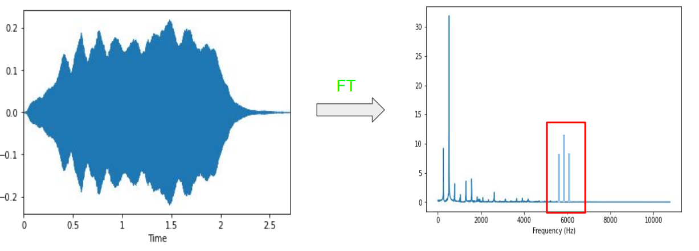
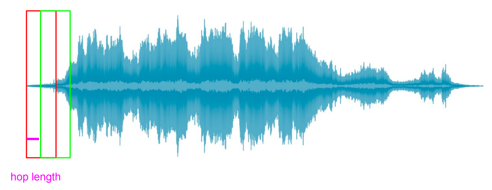

# Extract Audio Features (提取音频特征)
## 一、Feature pipeline (特征管线)

### 1. Frames (分帧)
- Perceivable audio chunk (可感知的语音“块”)
- 1 sample @44.1KHz = 0.0227ms, 即一个采样点的长度
- Duration 1 sample << Ear’s time resolution $\approx$ 10ms 人耳朵可以听到的最低分辨率
- The num of a sample in a frame: $2^n$: (一帧，一般包括：$2^n$个samples)
- The typical values of ($K$): 256 - 8192
  - duration of the frame (时长）:$d_f=\displaystyle\frac{1}{s_r}\cdot K$
  
    例：当$K=512, S_R=44.1kHz$, $d_f = \displaystyle\frac{1}{44100}\cdot 512=11.6ms$

### 2. Spectral leakage (谱泄漏)
- Processed signal isn’t an integer number of periods (处理后的信号不是周期的整数)
- Endpoints are discontinuous (（前后）**端点不连续**)
  
  
- Discontinuities appear as high-frequency components not present in the original signal (不连续**表现为原始信号中不存在的高频成分**)
  
  

### 3. Windowing (加窗)
- Apply windowing function to each frame (对每一帧应用窗口函数)
- Eliminates samples at both ends of a frame (消除帧两端的样本)
- Generates a periodic signal (生成一个周期性信号)

使用权重Haan window (汉宁窗): $$w(k)=0.5\cdot (1-cos(\frac{2\pi k}{K-1})), k=1...K$$

通过下图上面两个曲线的在对应采样点的值的乘积：

$$s_w(k)=s(k)\cdot w(k), k=1...K$$

得到了最下面的一条曲线：

> 加窗的目的: 让一帧信号的幅度在两端渐变到0（使端点平滑）, 防止**谱泄漏**

### 4. Overlapping frames (重叠帧)
在加窗时，前后端点的信号被移除，导致之后FT时丢失信号：

为了解决上述问题，需要使用**重叠帧**：

- hop length (跳跃步长): 进入下一帧时sample向右移动的数量

### 5. Aggregation (聚合)
- Mean (平均值)
- Median (中位数)
- GMM (高斯混合模型)

## 二、The Process of Extracting Audio Features

```mermaid
graph TD
    A["Input Signal(Analog signal)"]-->|Sampling & Quantization|B["Digital Signal"]
    B-->|Framing & Windowing & FT|C["Feature computation"]
    C-->D["Aggregation"]
    D-->E["Feature Vector"]
```