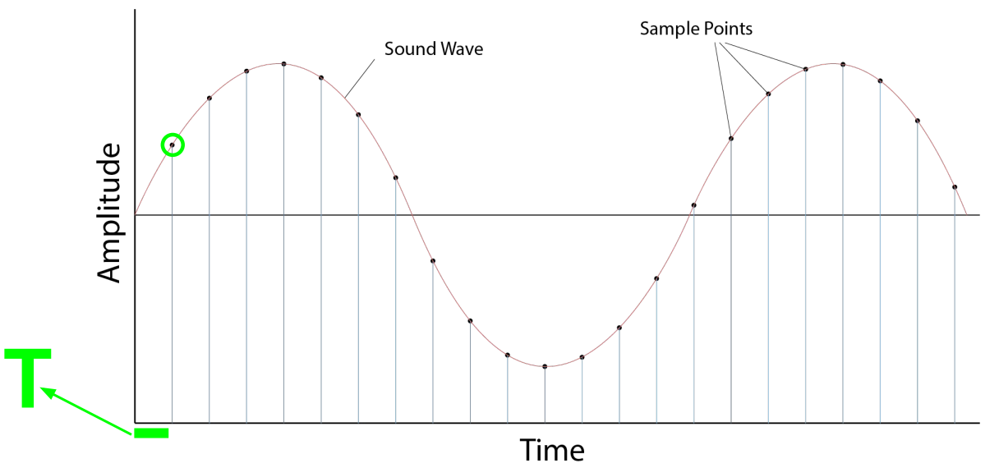
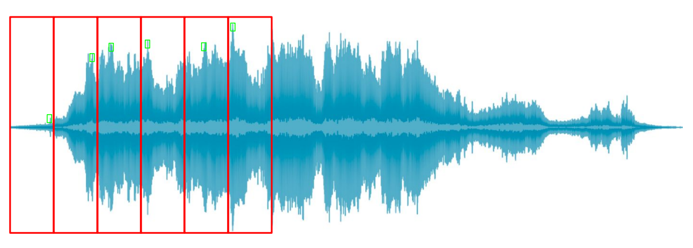
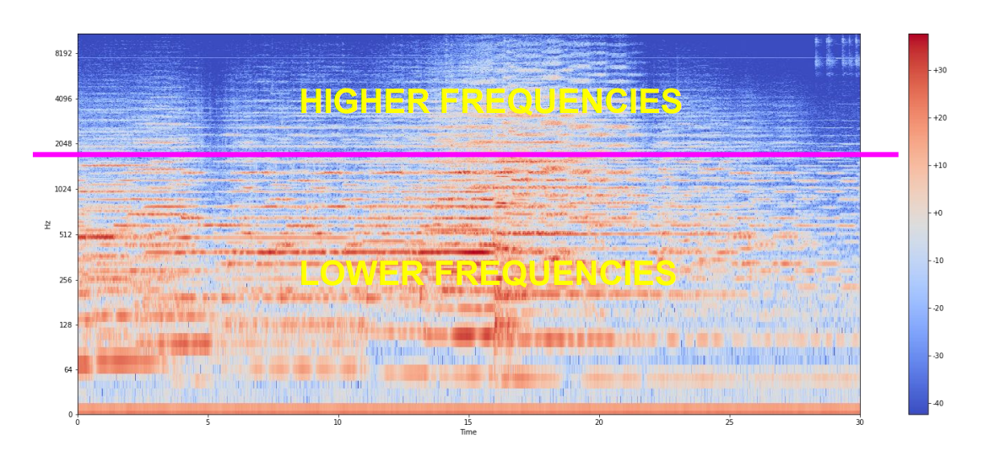
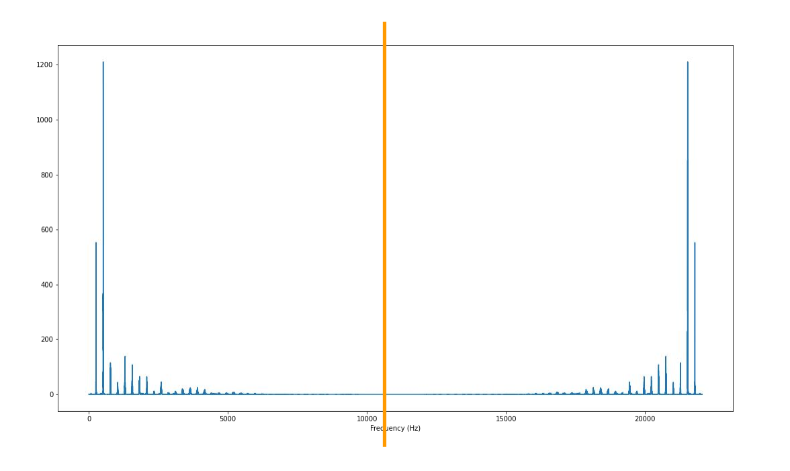
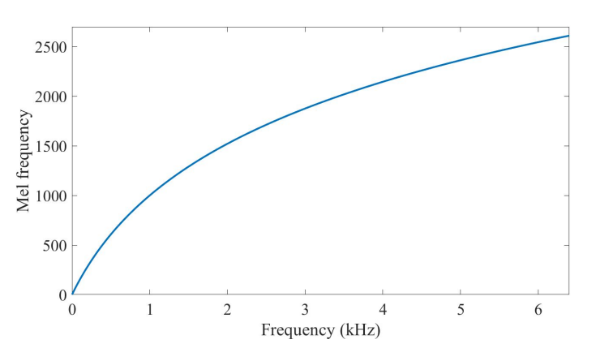

# Review
```mermaid
graph LR
A["Audio signal processing"]-->AB1["Basic Audio features"]
   AB1-->AB1C1["Pitch (音调)"]
   AB1-->AB1C2["Cents (音分)"]
   AB1-->AB1C3["Intensity level (声强级)"]
   AB1-->AB1C4["Loudness (响度)"]
   AB1-->AB1C5["Timbre (音色)"]
A-->AB2["ADC"]
   AB2-->AB2C1["Sampling (采样)"]
   AB2-->AB2C2["Quantization (量化)"]
A-->AB3["Time-domain audio features"]
   AB3-->AB3C1["AE (振幅包络)"]
   AB3-->AB3C2["RMS (均方根能量)"]
   AB3-->AB3C3["ZCR (过零率)"]
A-->AB4["Frequency-domain audio features"]
   AB4-->AB4C1["BER (频带能量比例)"]
   AB4-->AB4C2["SC (谱距心)"]
   AB4-->AB4C3["Bandwidth (带宽)"]
A-->AB5["Extract MFCC"]
   AB5-->AB5C1["Pre-Emphasis (预加重)"]
   AB5-->AB5C2["Frames (分帧)"]
   AB5-->AB5C3["Windowing (加窗)"]
   AB5-->AB5C4["STFT (短时傅里叶变换)"]
   AB5-->AB5C5["Mel filter banks (梅尔滤波器组)"]
   AB5-->AB5C6["Log operation (对数运算)"]
   AB5-->AB5C7["DCT (离散余弦变换)"]
   AB5-->AB5C["Dynamic feature extraction (动态特征提取)"]
```

# 一、Basic Audio features (基本音频特征)
> [Chapter 2](Chapter2_SoundAndWaveforms.md)
> 
> [Chapter 3](Chapter3_IntensityLoudnessAndTimbre.md)

## ① Pitch (音调)
- Logarithmic perception (对数感知)
- 2 frequencies are perceived similarly if they differ by a power of 2 （如果两个频率的差别是2的幂次，则他们听起来是一样的（即增八度）-除了强度和音量）

## ② Cents (音分)
- Octave divided in 1200 cents （八度音阶，被分成1200个音分）
- 100 cents in a semitone （一个“半音程”中有100个音分）
- Noticeable pitch difference: 10-25 cents （可识别的音高的差别：10-25音分）

## ③ Intensity level (声强级)
$$\huge dB(I)=10\cdot log_{10}(\frac{I}{I_{TOH}})$$
> Threshold of hearing（听觉阈值）:
> 
> - $I_{TOH}=10^{-12}W/m^2(声强度单位)$

- $dB(I_{TOH})=10\cdot log_{10}(\frac{I_{TOH}}{I_{TOH}})=0$, **即最小声强度TOH对应0分贝**
- Every ~3 dBs, intensity doubles ： 大约每增大3分贝，声强度翻倍。
  
  $dB(2I)-dB(I)=10\cdot log_{10}(\frac{2I}{I_{TOH}})-10\cdot log_{10}(\frac{I}{I_{TOH}})=10\cdot log_{10}2\approx 3dB$
## ④ Loudness (响度)
- Subjective perception of sound intensity (声强级的主观感知)
- Depends on duration / frequency of a sound (依赖于声音的音长/频率)
- Depends on age (依赖于年龄)
- Measured in phons (“方”是度量响度的单位)

Equal loudness contours：

## ⑤ Timbre (音色)
- Colour of sound (声音的颜色)
- Diff between two sounds with same intensity, frequency, duration (两个具有相同强度、频率和持续时间的声音之间的差异)
- Described with words like: bright, dark, dull, harsh, warm (描绘音色的词包括，明亮，黑暗，迟钝，刺耳，温暖等（偏主观感受）)
- Multifactorial sound dimension (多因子的语音维度)
- Amplitude envelope (振幅包络)
# 二、ADC (模数转换)
> [Chapter 4](Chapter4_UnderstandingAudioSignalsForML.md)

## ① Sampling (采样)

- Locating samples (定位采样点)
  $$\huge t_n=n\cdot T$$
- Sampling rate (采样率，单位$Hz$)
  $$\huge s_r = \frac{1}{T}$$
- Nyquist frequency (奈奎斯特频率)
  $$\huge s_r=2\cdot f_n$$
- Nyquist frequency for CD: $44100Hz$
  
  原因：人类能听到的声音频率范围：20~20000Hz；所以对于CD，最高频率约为$f_N=\displaystyle\frac{44100}{2}=22050Hz$，所以设置奈奎斯特采样频率为44100Hz
## ② Quantization (量化)

- Resolution = num. of bits (分辨率 = 位数)
- Bit depth (位深度)
> resolution与Bit depth是同义词
- CD quantization resolution = 16 bits (CD的分辨率为16bits)
  - 例：CD的分辨率为16bits，则所有可以使用的幅度值为$2^{16}=65536$
- SQNR (信号与量化噪声之比)
    $$SQNR=20log_{10}2^Q\approx6.02\cdot Q$$
    $$SQNR(16)\approx96dB$$
  >   **AD 位深度越大，信噪比越高，量化误差越小**
# 三、Time-domain audio features (时域特征)
> [Chapter 7](Chapter7_TimeDomainAudioFeatures.md)

## ① Amplitude envelope (AE, 振幅包络)
- Max amplitude value of all samples in a frame (一帧内所有samples的最大振幅值):$$AE_t=max_{k=t\cdot K}^{(t+1)\cdot K-1}s(k)$$
  - $K: \textnormal{Frame size}$ (一帧的sample数量)
  - $s(k): \textnormal{Amplitude of kth sample}$
  - $k\in[t\cdot K,(t+1)\cdot K-1]$
    - $t\cdot K$: first sample of frame t
    - $(t+1)\cdot K-1$: last sample of frame t
  
  
## ② Root-mean-square energy (RMS, 均方根能量)
- RMS of all samples in a frame (一个坐标系中所有样本的均方根)$$RMS_t=\sqrt{\frac{1}{K}\cdot\sum_{k = t\cdot K}^{(t+1)\cdot K-1}s(k)^2}$$
  - $s(k)^2$: Energy of *k*th sample
## ③ Zero-crossing rate (ZCR, 过零率)
- Number of times a signal crosses the horizontal axis (信号穿过横轴的次数)$$ZCR_t=\frac{1}{2}\cdot\sum_{k=t\cdot K}^{(t+1)\cdot K-1}|\ sgn(s(k))-sgn(s(k+1))\ |$$ $$sgn(x)=\begin{cases}\text{$1$\ \ \ \ \ x>0}\\\text{$-1$\ \ x<0}\\\text{$0$\ \ \ \ \ x=0}\\ \end{cases}$$
- Monophonic pitch estimation = (单声道音高估计: **ZCR越大，一般pitch越高**)
- Voice/unvoiced decision for speech signals (针对语音信号的清音/浊音决定)
  
  

# 四、Frequency-domain audio features (频域特征)
> [Chapter 21](Chapter21_Frequencydomainaudiofeatures.md)

## ① Band energy ratio (BER 频带能量比例)
- Comparison of energy in the lower/higher frequency bands (低频段和高频段能量的比较)
- Measure of how dominant low frequencies are （低频占据多大优势）

### 1. Function
$$BER_t=\frac{\displaystyle\sum_{n=1}^{F-1}m_t(n)^2}{\displaystyle\sum_{n=F}^{N}m_t(n)^2}$$
> 实际意义：低频能量 / 高频能量
>
> $m_t(n)^2$: 频率为n，帧为t处的能量
>
> $F$: Split frequency (切割频率)

## ② Spectral centroid (SC谱距心)
- Centre of gravity of magnitude spectrum (幅度谱的重心)
- Frequency band where most of the energy is concentrated (**频率频带,大部分能量集中在那里**)
- Measure of “brightness” of sound (声音响度的度量)
### 1. Function
- Weighted mean of the frequencies (频率的加权平均值)
  $$SC_t=\frac{\displaystyle\sum_{n=1}^{N}m_t(n)\cdot n}{\displaystyle\sum_{n=1}^{N}m_t(n)}$$
> $m_t(n)$: 频率为n，帧为t处幅度 或 **n处的权重**
## ③ Bandwidth (带宽，weighted mean)
- Derived from spectral centroid (衍生于”谱心“)
- Spectral range around the centroid (谱距心周围的频谱范围)
- Variance from the spectral centroid (谱距心的方差)
- Describe perceived timbre (感知”音色“)

### 1. Function
$$BW_t=\frac{\displaystyle\sum_{n=1}^{N}|n-SC_t|\cdot m_t(n)}{\displaystyle\sum_{n=1}^{N}m_t(n)}$$
> $|n-SC_t|$: 谱距心离频带n的距离
>
> $m_t(n)$: 频率为n，帧为t处幅度 或 **n处的权重**
# 五、Extract MFCC (MFCC的提取过程)
> [Chapter 12: FFT](Chapter12_DefingFTUsingCN.md)
> 
> [Chapter 13: DFT](Chapter13_DiscreteFourierTransform.md)
> 
> [Chapter 15: STFT](Chapter15_STFT.md)
> 
> [Chapter 17: MelSpectrogram](Chapter17_MelSpectrogram.md)
> 
> [Chapter 19: MFCC](Chapter19_MFCC.md)

## ① FT & IFT (傅里叶变换 与 逆傅里叶变换)
$$\textnormal{FT:}\ \ \ \ \ \ \ \ \ \ \hat{g}(f)=\int g(t)\cdot e^{-i2\pi ft}dt$$
$$\textnormal{FT}^{-1}:\ \ g(t)=\frac{1}{2\pi}\int \hat{g}(f)\cdot e^{i2\pi ft}df$$
## ② DFT (离散傅里叶变换)
$$\hat{x}(k)=\sum_{n=0}^{N-1}x[n]\cdot e^{-i2\pi s_r n \frac{k}{N}}\ \ \ ,k\in[0, N-1]$$
- #frequencies (M) = #samples (N) ( **采样点的数量=频率的取值数量** )
- DFT频率的取值空间: $F(k)=\displaystyle\frac{f}{T}=\displaystyle\frac{k}{NT}=\frac{ks_r}{N}\in[0,s_r)$
- Redundancy in DFT (DFT中的冗余)
  
  

  **离散傅里叶变换的时候，左右对称**，如上图所示，揭示了DFT的“冗余”问题.

  $k=\displaystyle\frac{N}{2}\rightarrow F(\frac{N}{2})=\frac{s_r}{2}$: 只有$[0,\displaystyle\frac{s_r}{2})$内的频率有效

  $s_r$为奈奎斯特频率（Nyquist frequency），是为**防止信号混叠 (aliasing)**定义的**最小采样频率**
## ③ FFT (快速傅里叶变换)
- DFT is computationally expensive ($N^2$) (DFT的时间复杂度是 $O(n^2)$，昂贵)
- FFT is more efficient ($Nlog_2N$) (FFT的时间复杂度是 $O(nlogn)$, 是更高效的算法)
- FFT exploits redundancies across sinusoids (FFT利用了正弦波之间的冗余来加速)
- FFT works when N is a power of 2 (当N是2的幂次的时候，FFT有效)
## ④ STFT (短时傅里叶变换)
我们知道“哪些频率分量出现在了语音信号中”,可惜我们**不知道“什么时候这些频率分量出现”**, 这是因为我们最终得到的magnitude是源信号的在所有时间上的求和。

### 1. Frames (分帧)
- 解决方法：Apply FFT locally (在局部信号区域上应用FFT)
  
  
> STFT的目的就是去定位，哪些频率分量，出现在了音波的哪些位置

### 2. Windowing (加窗)
- Apply windowing function to signal (对信号应用加窗函数) $$x_w(k)=x(k)\cdot w(k)$$

> 默认window size = frame size， 但有时会发生window size > frame size

### 3. From DFT to STFT
$$DFT:\ \ \hat{x}(k)=\sum_{n=0}^{N-1}x[n]\cdot e^{-i2\pi s_r n \frac{k}{N}}\ \ \ ,k\in[0, N-1]$$
$$STFT:\ \ S(m, k)=\sum_{n=0}^{N-1}x[n+mH]\cdot w[n]\cdot e^{-i2\pi s_r n \frac{k}{N}}\ \ \ ,k\in[0, N-1]$$

- $m$: frame number (帧号)
- $k$: sample number (样本号)
- $H$: hop size (跳跃步长)
- $mH$: starting sample of current frame (当前的frame的起始采样点)
  

### 4. Outputs (DFT和STFT的输出的区别)
- DFT (离散傅里叶变换)
  - Spectral vector (# frequency bins) (谱向量: 每个频率frequency一个复数对应（magnitude, phase）)
  - N complex Fourier coefficients (设采样点数量为N，则一共输出的是N个复数的“傅里叶系数”)
- **STFT - 短时傅里叶变换**
  - **Spectral matrix (# frequency bins, # frames num)**  (谱矩阵，（frequency, frames num） 对应 （magnitude, phase）)
  - Complex Fourier coefficients (复数傅里叶系数)
- $\# \textnormal{frequency bins}=\displaystyle\frac{\textnormal{framesize}}{2}+1$
  > \#frequency bins: 频域中样本之间的频率间隔/频率分布，即N
  > 
  > framesize: 一个frame里面有多少个samples
### 5. STFT parameters (STFT参数)
- Frame size (K): 512, 1024, 2048, 4096, 8192
- Hop size: 256, 512, 1024, 2048, 4096 或 ½ K, ¼ K, ⅛ K
- Windowing function （Haan window (汉宁窗)）: $$w(k)=0.5\cdot (1-cos(\frac{2\pi k}{K-1})), k=1...K$$
  
  
### 6. Visualising sound: Spectrogram (声音可视化: 能量谱)
$$\huge Y(m, k)=|S(m, k)|^2$$

> 声谱图 (Spectrogram)
> - 作用：表示在不同的时间和频率上这些声音的能量有多大
> - 横轴：时间
> - 纵轴：频率
> - 图中颜色：声波能量大小
## ⑤ Mel Spectrogram
### 1. Mel-scale (梅尔刻度 （for pitch-音高）)
- Logarithmic scale (对数刻度)
- Equal distances on the scale have same “perceptual” distance (**在“梅尔刻度”上，相同的距离，有相同的“感知距离”**)
- 1000 Hz = 1000 Mel

$$m=2595\cdot log(1+\frac{f}{700})$$
$$f=700(10^{m/2595}-1)$$

### 2. Recipe to extract Mel spectrogram (抽取梅尔谱的算法)
- Extract STFT (抽取stft)
- Convert amplitude to DBs (把振幅转换为db，分贝)
- Convert frequencies to Mel scale (把频率转换为Mel-scale (梅尔刻度）)
  - Choose number of **mel bands** (选择mel频段的数量)
  - Construct **mel filter banks** (构建梅尔滤波器组)
    - Convert lowest / highest frequency to Mel (将最低频率和最高频率转到mel-scale上)
    - Create # bands equally spaced points (创建等距点的带)
    - Convert points back to Hertz (将取的点又转回Hertz)
    - Create Mel filter banks (生成三角滤波器)
  - Apply mel filter banks to **spectrogram** (应用梅尔滤波器组到声谱)
    - Shape of matrix:
    $$M_{\textnormal{shape}}=(\# \ \textnormal{bands num},\ \displaystyle\frac{\textnormal{framesize}}{2}+1)=(n, m)$$
    $$Y_{\textnormal{shape}}=(\displaystyle\frac{\textnormal{framesize}}{2}+1,\ \# \ \textnormal{frames num})=(m, k)$$
    $$U_{\textnormal{shape}}=\textnormal{M}\cdot\textnormal{Y}=(\# \ \textnormal{bands num},\ \# \ \textnormal{frames num})=(n, k)$$
    - Matrix:
    $$
    M =
        \underbrace{\left[
            \begin{array}{c}
            \cdots  & w^{(1)} & \cdots\\
            \cdots  & w^{(2)} & \cdots\\
            \cdots  & \vdots  & \cdots\\
            \cdots  & w^{(n)} & \cdots\\
            \end{array}
            \right]}_m
    $$
    $$
    Y = 
        \left .\ \left[
            \begin{array}{c}
            \vdots  & \vdots  & \vdots & \vdots\\
            y^{(1)} & y^{(2)} & \cdots & y^{(k)}\\
            \vdots  & \vdots  & \vdots & \vdots\\
            \end{array}
            \right]\right \}m
    $$

    $$
    U = M\cdot Y =
        \left[
            \begin{array}{c}
            u_{11}  & u_{12}  & \cdots & u_{1k}\\
            u_{21}  & u_{22}  & \cdots & u_{2k}\\
            \vdots  & \vdots  & \ddots & \vdots\\
            u_{n1}  & u_{n2}  & \cdots & u_{nk}\\
            \end{array}
            \right]
    $$
    > M: Mel filter banks (梅尔滤波器组), 矩阵内是权重
    > - $M_{nm}$第n个mel band 对 第m个频率的weight
    >
    > Y: Spectrogram (功率谱/能量谱), 矩阵内是magnitude
    > - $Y_{mk}$是第k帧中第m个频率的magnitude
    >
    > U: Mel spectrogram (梅尔谱), 矩阵内是**加权后**的magnitude
    > - $U_{nk}$是 **经过第n个mel band过滤/加权后 第k帧的magnitude**
## ⑥ Log operation (对数运算)
- **使用对数的好处**：

  使频域中的声道频率响应 与 声门脉冲 分离(使用加法相加)，这样就可以只关注更重要的**声道频率响应**

  
- log的用处：
  
  $$X[k]=E[k]\cdot H[k]$$

  $$\Downarrow log$$

  $$log(X[k])=log(E[k])+log(H[k])$$

  $$\Downarrow DCT$$

  $$x[k]=e[k]+h[k]$$

  

  - 我们可以从 low quefrency value 中得到  语音频谱信号中**缓慢**变化的信息 
    > 基音信息：与频谱包络相关的信息，如 共振峰的信息、音素、音色
  - 我们可以从 high quefrency value 中得到 语音频谱信号中**快速**变化的信息 
    > 声道信息：声门脉冲，如 音高
  - 使用低通滤波器，过滤掉 high quefrency 中的信息，**仅关注 与频谱包络相关的信息**
  
## ⑦ DCT (离散余弦变换)
### 1. Why Discrete Cosine Transform? (为什么使用DCT)
- Simplified version of Fourier Transform (傅里叶变换的简化版)
- Get real-valued coefficient (获得实值系数)
- Decorrelate energy in different mel bands (在不同的mel波段 decorrelate 能量)
- Reduce # dimensions to represent spectrum (减少频率维度的向量数量来表示频谱)

### 2. DCT公式：(与DFT相似，时域$\rightarrow$频域)
$$F(u)=c(u)\sum_{x=0}^{N-1}f(x)cos[\frac{(x+0.5)\pi}{N}u]，\ \ u=0,1,\cdots N-1$$
$$
c(u)=
    \begin{cases}
    \text{$\displaystyle\sqrt{\frac{1}{N}}\qquad u=0$}\\
    \text{$\displaystyle\sqrt{\frac{2}{N}}\qquad u\neq0$}\\
    \end{cases}
$$
> DCT后得到12维的MFCC特征
- $c(u)$：正交化因子，主要是为了在DCT变换变成矩阵运算的形式时，将该矩阵正交化以便于进一步的计算，实际计算中可以去掉$c(u)$
- $f(x)$：时域信号
- cos内是$\pi$而不是$2\pi$的原因：DCT将信号长度扩大成原来的2倍,长度变成2N
- cos内 $x+0.5$ 的原因：把整个延拓的信号向右平移 0.5 个单位，让插值后的信号关于远点对称

详细推导过程看[详解离散余弦变换（DCT）(zhihu)](https://zhuanlan.zhihu.com/p/85299446)
## ⑧ Dynamic feature extraction (动态特征提取)
- Traditionally: first 12 - 13 coefficients (最初得到12维的MFCC特征)
- First coefficients keep most information (e.g., formants/共振峰, spectral envelope/谱包络)
- Use Δ and ΔΔ MFCCs (一阶差分参数 和 二阶差分参数)
- Total 39 coefficients per frame (动态特征提取后，一个frame里面是39个系数：13是来自原来的frame的MFCC的，然后是MFCC的13个一阶差分参数，最后是MCFF的13个二阶差分参数)
  > 标准的倒谱参数MFCC只反映了语音参数的静态特性，语音的动态特性可以用这些静态特征的差分谱来描述。实验证明：把动、静态特征结合起来才能有效提高系统的识别性能。

上图的mfcc特征图是13维的 (只包括静态特征)