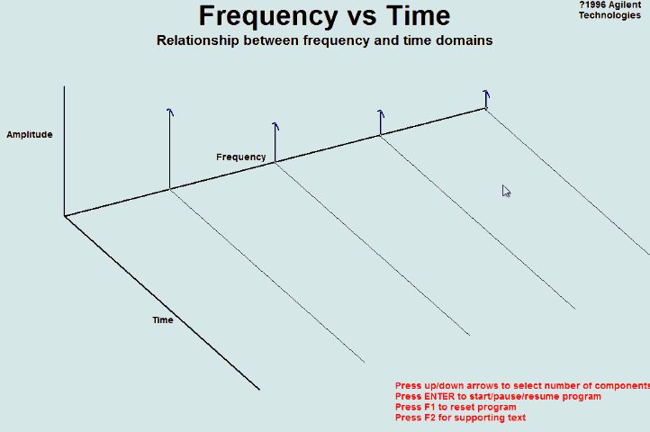

# [音频信号处理入门](https://zhuanlan.zhihu.com/p/386467252)
```mermaid
graph LR
    A["音频信号处理"]-->AB1["音频信号概念"]
        AB1-->AB1C1["时域和频域"]
        AB1-->AB1C2["采样定理"]
        AB1-->AB1C3["基频、共振峰"]
    A-->AB2["语音信号处理"]
        AB2-->AB2C1["分帧加窗"]
        AB2-->AB2C2["傅里叶变换"]
        AB2-->AB2C3["STFT / FFT"]
        AB2-->AB2C4["mel滤波"]
```
## 音频信号概念
### 时域和频域
1. 时域：信号在时间轴随时间变化的总体概括
   - 画出的波形：波形图
   - 横轴：时间
   - 纵轴：音频的波幅（或能量）
2. 频域：把时域波形的表达式做傅立叶等变化得到复频域的表达式
   - 画出的波形：频谱图
   - 横轴：频率
   - 纵轴：该频率信号的幅度
3. 声谱图
   - 作用：表示在不同的时间和频率上这些声音的能量有多大
   - 横轴：时间
   - 纵轴：频率
   - 图中颜色：声波能量大小

### 采样定理（奈奎斯特定理）
1. 采样率 * 语音时长 = 语音采样点数
2. 当采样频率$f_{smax}$大于信号中最高频率$f_{max}$的2倍时($f_{smax}>2f_{max}$)，**采样之后的数字信号完整地保留了原始信号中的信息**，一般实际应用中保证采样频率为信号最高频率的2.56～4倍

## 语音信号处理
### 语音信号处理流程
```mermaid
graph TD
    A["输入语音信号"]-->B["分帧、预加重、加窗"]
    B-->C["FFT"]
    C-->D["对复数取绝对值或平方值"]
    D-->|SFTF特征|E["Mel滤波"]
    E-->F["取对数"]
    F-->|melspec特征|G["DCT(离散余弦变换)"]
    G-->|Fbank特征|H["计算动态特征(Delta MFCC)"]
    H-->|输出特征向量|I["MFCC特征"]

```
### 傅里叶变换
1. 傅里叶级数：$$a_k = \frac{1}{T}\int_{-\infty}^{\infty}x(t)e^{-jk\omega_0t}dt$$
2. 傅里叶变换：
   - 非周期连续时间信号傅里叶变换：
     - 时域->频域 ($FT$)：$$X(j\omega)=\int_{-\infty}^{\infty}x(t)e^{-j\omega t}dt$$
     - 频域->时域 ($FT^{-1}$)：$$x(t)=\frac{1}{2\pi}\int_{-\infty}^{\infty}X(j\omega)e^{j\omega t}d\omega$$
   - 离散傅里叶变换：
     - 时域->频域 ($DFT$)：$$X(e^{j\omega})=\sum_{n=-\infty}^{\infty}x[n]e^{-j\omega n}$$
     - 频域->时域 ($DFT^{-1}$)：$$x[n]=\frac{1}{2\pi}\int_{2\pi}X(e^{j\omega})e^{j\omega n}d\omega$$
   - 周期信号中：$$x(t)=\sum_{k=-\infty}^{+\infty}a_ke^{jk\omega_0t}$$